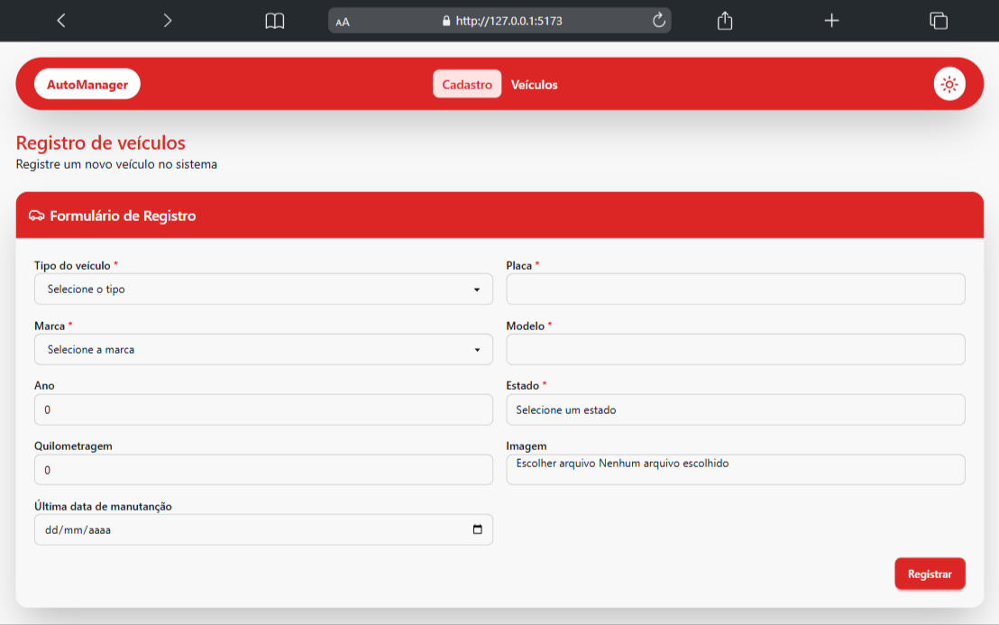
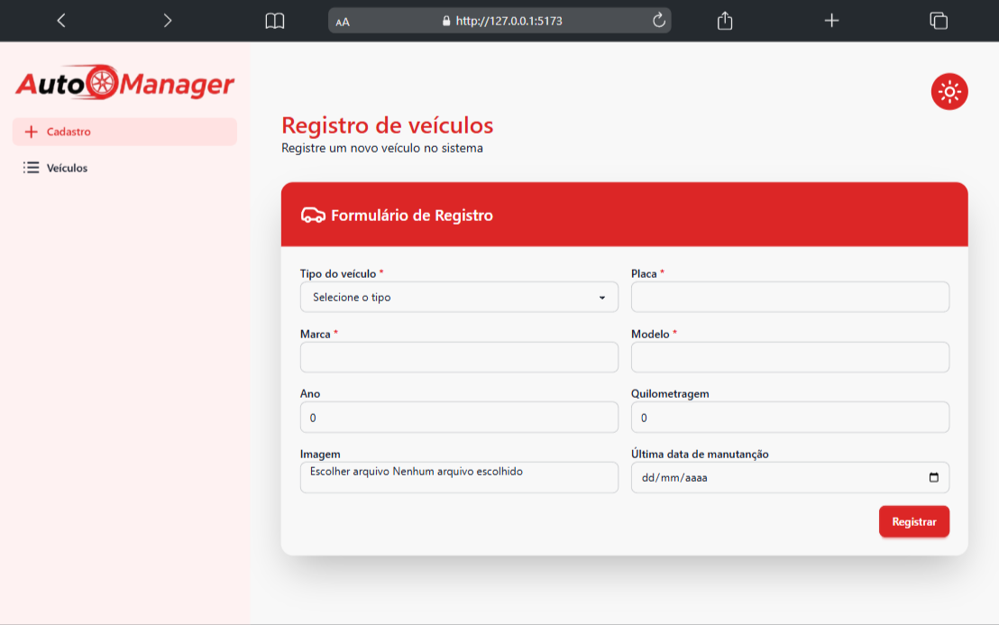

# AutoManager 🚗

**AutoManager** é uma aplicação web desenvolvida em **React + TypeScript** para gerenciamento de veículos. O projeto permite cadastro, listagem, visualização e edição de automóveis.

## 🖼️ Demonstração

<div style="display: flex; gap: 10px;">
  
  
</div>

## 🚀 Funcionalidades

- 📋 Listagem de veículos com paginação
- ➕ Cadastro de novos veículos
- 🛠️ Edição de veículos existentes
- 🔍 Visualização de detalhes
- 🎨 Controle de tema

## 🛠️ Tecnologias

- [React](https://reactjs.org/)
- [TypeScript](https://www.typescriptlang.org/)
- [Tailwind CSS](https://tailwindcss.com/)
- [DaisyUI](https://daisyui.com/)
- [Axios](https://axios-http.com/)
- [React Router DOM](https://reactrouter.com/)
- [Lucide React](https://lucide.dev/)

## 📦 Instalação

```bash
git clone https://github.com/analeao-dev/AutoManager.git
cd AutoManager
npm install
npm run dev
```

> A aplicação será executada em `http://localhost:5173`

## 📄 Licença

MIT © [analeao-dev](https://github.com/analeao-dev)
